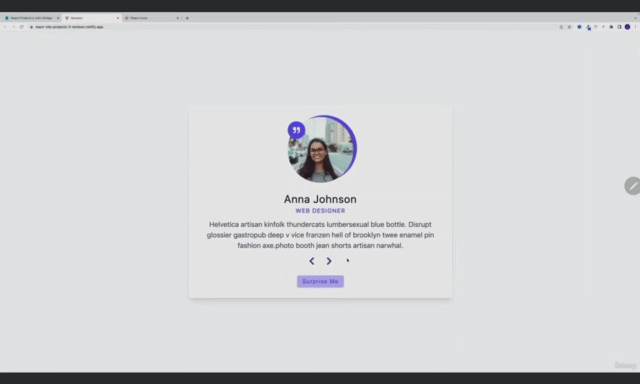

#### 181. [Reviews - Setup](#181)

#### 182. [Reviews - Data](#182)

#### 183. [Reviews - React Icons](#183)

#### 184. [Reviews - First Person](#184)

#### 185. [Reviews - Prev and Next](#185)

#### 186. [Reviews - Check Number](#186)

#### 187. [Reviews - Random Person](#187)

#### 188. [Reviews - Modulus Operator](#188)

#### 189. [Reviews - CSS (Optional)](#189)

---

<br>

### 181. Reviews - Setup<a id='181'></a>

> **_Business Objective: Layout_**



- [Live App](https://react-vite-projects-3-reviews.netlify.app/)

---

##### Figma URL

[Reviews](https://www.figma.com/file/e8L2QiR4GVTa5cGuRpXtk3/Reviews?node-id=0%3A1&t=gcCYcePiKxnkJ9kH-1)

- install deps

```sh
npm install
```

- spin up dev server

```sh
npm run dev
```

<br>

### 182. Reviews - Data<a id='182'></a>

### Steps

#### Explore Data

Navigate to data.js and take a look at the data structure

#### Import Reviews

First, import the reviews data into your project. This data should be an array of objects, with each object representing a person's review and containing properties such as name, job, image URL, and text.

#### Setup State Value (Index)

Then, set up a state value that controls which person from the list is displayed.

---

- In src/App.jsx

```js
import { useState } from "react";
import people from "./data";

const App = () => {
  const [index, setIndex] = useState(0);
  const { name, job, image, text } = people[index];

  console.log(name);

  return <h2>Reviews Starter</h2>;
};

export default App;
```

<br>

### 183. Reviews - React Icons<a id='183'></a>

#### React Icons (Optional)

[Docs](https://react-icons.github.io/react-icons/)

```sh
npm install react-icons --save
```

- In src/App.jsx

```js
import { useState } from "react";
import people from "./data";
// 1. icon import
import { FaBeer } from "react-icons/fa";

const App = () => {
  const [index, setIndex] = useState(0);
  const { name, job, image, text } = people[index];

  console.log(name);

  return (
    <div>
      <h2>Reviews Starter</h2>;{/* 2. icon usage */}
      <FaBeer className="beer" />
    </div>
  );
};

export default App;
```

<br>

### 184. Reviews - First Person<a id='184'></a>

#### Render First Person

To render the first person in the list, you can access the first item in the reviews array and use its properties to display the person's image (inline styles), name, job, and review text.

---

- In src/App.jsx, setup template

```js
import { useState } from "react";
import people from "./data";
import { FaChevronLeft, FaChevronRight, FaQuoteRight } from "react-icons/fa";

const App = () => {
  const [index, setIndex] = useState(0);
  const { name, job, image, text } = people[index];

  return (
    <main>
      <article className="review">
        <div className="img-container">
          
          <span className="quote-icon">
            <FaQuoteRight />
          </span>
        </div>

        <h4 className="author">{name}</h4>
        <p className="job">{job}</p>
        <p className="info">{text}</p>
      </article>
    </main>
  );
};

export default App;
```

<br>

### 185. Reviews - Prev and Next<a id='185'></a>

#### Prev and Next

To allow the user to cycle through the reviews, you can set up buttons to display the next and previous reviews in the list. You can do this by keeping track of the current index in the reviews array, and updating the index when the user clicks the next or previous button. You can then use the updated index to access the corresponding person's review from the reviews array.

---

- In src/App.jsx

```js
import { useState } from "react";
import people from "./data";
import { FaChevronLeft, FaChevronRight, FaQuoteRight } from "react-icons/fa";
const App = () => {
  const [index, setIndex] = useState(0);
  const { name, job, image, text } = people[index];

  const nextPerson = () => {
    setIndex((currentIndex) => {
      let newIndex = currentIndex + 1;
      return newIndex;
    });
  };

  const prevPerson = () => {
    setIndex((currentIndex) => {
      let newIndex = currentIndex - 1;
      return newIndex;
    });
  };

  return (
    <main>
      <article className="review">
        <div className="img-container">
          
          <span className="quote-icon">
            <FaQuoteRight />
          </span>
        </div>

        <h4 className="author">{name}</h4>
        <p className="job">{job}</p>
        <p className="info">{text}</p>

        <div className="btn-container">
          <button className="prev-btn" onClick={prevPerson}>
            <FaChevronLeft />
          </button>

          <button className="next-btn" onClick={nextPerson}>
            <FaChevronRight />
          </button>
        </div>
      </article>
    </main>
  );
};

export default App;
```

<br>

### 186. Reviews - Check Number<a id='186'></a>

#### Random

To allow the user to display a random person's review, you can set up a button with functionality to randomly select an index in the reviews array. You can then use the selected index to display the corresponding person's review.

---

- In src/App.jsx

```js
import { useState } from "react";
import people from "./data";
import { FaChevronLeft, FaChevronRight, FaQuoteRight } from "react-icons/fa";

const App = () => {
  const [index, setIndex] = useState(0);
  const { name, job, image, text } = people[index];

  // tracking index
  const checkNumber = (number) => {
    // condition: if number is bigger than array length then
    // upper bound limit
    if (number > people.length - 1) {
      // return 0 index
      return 0;
    }

    // condition: if number is smaller that 0
    // lower bound limit
    if (number < 0) {
      // return last array index
      return people.length - 1;
    }

    // no condition: middle bound
    return number;
  };

  const nextPerson = () => {
    setIndex((index) => {
      let newIndex = index + 1;
      // call
      return checkNumber(newIndex);
    });
  };

  const prevPerson = () => {
    setIndex((index) => {
      let newIndex = index - 1;
      // call
      return checkNumber(newIndex);
    });
  };

  const randomPerson = () => {
    let randomNumber = Math.floor(Math.random() * people.length);
    if (randomNumber === index) {
      randomNumber = index + 1;
    }
    setIndex(checkNumber(randomNumber));
  };

  return (
    <main>
      <article className="review">
        <div className="img-container">
          
          <span className="quote-icon">
            <FaQuoteRight />
          </span>
        </div>

        <h4 className="author">{name}</h4>
        <p className="job">{job}</p>
        <p className="info">{text}</p>
        <div className="btn-container">
          <button className="prev-btn" onClick={prevPerson}>
            <FaChevronLeft />
          </button>
          <button className="next-btn" onClick={nextPerson}>
            <FaChevronRight />
          </button>
        </div>
      </article>
    </main>
  );
};

export default App;
```

<br>

### 187. Reviews - Random Person<a id='187'></a>

- In src/App.jsx

```js
import { useState } from "react";
import people from "./data";
import { FaChevronLeft, FaChevronRight, FaQuoteRight } from "react-icons/fa";

const App = () => {
  const [index, setIndex] = useState(0);
  const { name, job, image, text } = people[index];

  const checkNumber = (number) => {
    if (number > people.length - 1) {
      return 0;
    }

    if (number < 0) {
      return people.length - 1;
    }

    return number;
  };

  const nextPerson = () => {
    setIndex((index) => {
      let newIndex = index + 1;
      return checkNumber(newIndex);
    });
  };

  const prevPerson = () => {
    setIndex((index) => {
      let newIndex = index - 1;
      return checkNumber(newIndex);
    });
  };

  // random function
  const randomPerson = () => {
    let randomNumber = Math.floor(Math.random() * people.length);
    if (randomNumber === index) {
      randomNumber = index + 1;
    }

    // in order to avoid bound limit from array passing through checkNumber
    setIndex(checkNumber(randomNumber));
  };

  return (
    <main>
      <article className="review">
        <div className="img-container">
          
          <span className="quote-icon">
            <FaQuoteRight />
          </span>
        </div>

        <h4 className="author">{name}</h4>
        <p className="job">{job}</p>
        <p className="info">{text}</p>
        <div className="btn-container">
          <button className="prev-btn" onClick={prevPerson}>
            <FaChevronLeft />
          </button>
          <button className="next-btn" onClick={nextPerson}>
            <FaChevronRight />
          </button>
        </div>

        <button className="btn btn-hipster" onClick={randomPerson}>
          surprise me
        </button>
      </article>
    </main>
  );
};

export default App;
```

<br>

### 188. Reviews - Modulus Operator<a id='188'></a>

#### Extra

The modulus operator in JavaScript is represented by the percent sign (%). It returns the remainder of a division operation between two numbers.

Overall, the flow of the application should look something like this:

- Import the reviews data into your project as an array of objects.
- Set up the reviews data as a state variable using the useState hook.
- Render the first person's review in the list using their image, name, job, and text properties.
- Set up buttons to display the next and previous reviews in the list. Keep track of the current index in the reviews array and update it when the user clicks the next or previous button.
- Set up a button to display a random person's review. This button should select a random index in the reviews array and use it to display the corresponding person's review.

---

- In src/Alternative.jsx

```js
import { useState } from "react";
import people from "./data";
import { FaChevronLeft, FaChevronRight, FaQuoteRight } from "react-icons/fa";

const App = () => {
  const [index, setIndex] = useState(0);
  const { name, job, image, text } = people[index];

  // 1 % 4 === 1
  // 2 % 4 === 2
  // 3 % 4 === 3
  // 4 % 4 === 0

  const nextPerson = () => {
    setIndex((index) => {
      // let newIndex = index + 1;
      // console.log(newIndex);
      // console.log(newIndex % people.length);
      const newValue = (index + 1) % people.length;
      console.log(newValue);
      return newValue;
    });
  };

  const prevPerson = () => {
    setIndex((index) => {
      const newValue = (index - 1 + people.length) % people.length;
      return newValue;
    });
  };

  const randomPerson = () => {
    let randomNumber = Math.floor(Math.random() * people.length);
    if (randomNumber === index) {
      randomNumber = index + 1;
    }
    const newIndex = randomNumber % people.length;
    // console.log(randomNumber, newIndex);
    setIndex(newIndex);
  };

  return (
    <main>
      <article className="review">
        <div className="img-container">
          
          <span className="quote-icon">
            <FaQuoteRight />
          </span>
        </div>

        <h4 className="author">{name}</h4>
        <p className="job">{job}</p>
        <p className="info">{text}</p>

        <div className="btn-container">
          <button className="prev-btn" onClick={prevPerson}>
            <FaChevronLeft />
          </button>

          <button className="next-btn" onClick={nextPerson}>
            <FaChevronRight />
          </button>
        </div>

        <button className="btn btn-hipster" onClick={randomPerson}>
          surprise me
        </button>
      </article>
    </main>
  );
};

export default App;
```

<br>

### 189. Reviews - CSS (Optional)<a id='189'></a>

- In src/index.css

```css
/* ============= GLOBAL CSS =============== */

*,
::after,
::before {
  margin: 0;
  padding: 0;
  box-sizing: border-box;
}

html {
  font-size: 100%;
} /*16px*/

:root {
  /* colors */
  --primary-100: #e2e0ff;
  --primary-200: #c1beff;
  --primary-300: #a29dff;
  --primary-400: #837dff;
  --primary-500: #645cff;
  --primary-600: #504acc;
  --primary-700: #3c3799;
  --primary-800: #282566;
  --primary-900: #141233;

  /* grey */
  --grey-50: #f8fafc;
  --grey-100: #f1f5f9;
  --grey-200: #e2e8f0;
  --grey-300: #cbd5e1;
  --grey-400: #94a3b8;
  --grey-500: #64748b;
  --grey-600: #475569;
  --grey-700: #334155;
  --grey-800: #1e293b;
  --grey-900: #0f172a;
  /* rest of the colors */
  --black: #222;
  --white: #fff;
  --red-light: #f8d7da;
  --red-dark: #842029;
  --green-light: #d1e7dd;
  --green-dark: #0f5132;

  --small-text: 0.875rem;
  --extra-small-text: 0.7em;
  /* rest of the vars */
  --backgroundColor: var(--grey-50);
  --textColor: var(--grey-900);
  --borderRadius: 0.25rem;
  --letterSpacing: 1px;
  --transition: 0.3s ease-in-out all;
  --max-width: 1120px;
  --fixed-width: 600px;

  /* box shadow*/
  --shadow-1: 0 1px 3px 0 rgba(0, 0, 0, 0.1), 0 1px 2px 0 rgba(0, 0, 0, 0.06);
  --shadow-2: 0 4px 6px -1px rgba(0, 0, 0, 0.1), 0 2px 4px -1px rgba(0, 0, 0, 0.06);
  --shadow-3: 0 10px 15px -3px rgba(0, 0, 0, 0.1), 0 4px 6px -2px rgba(0, 0, 0, 0.05);
  --shadow-4: 0 20px 25px -5px rgba(0, 0, 0, 0.1), 0 10px 10px -5px rgba(0, 0, 0, 0.04);
}

body {
  background: var(--backgroundColor);
  font-family: system-ui, -apple-system, BlinkMacSystemFont, "Segoe UI", Roboto,
    Oxygen, Ubuntu, Cantarell, "Open Sans", "Helvetica Neue", sans-serif;
  font-weight: 400;
  line-height: 1;
  color: var(--textColor);
}
p {
  margin: 0;
}
h1,
h2,
h3,
h4,
h5 {
  margin: 0;
  font-family: var(--headingFont);
  font-weight: 400;
  line-height: 1;
  text-transform: capitalize;
  letter-spacing: var(--letterSpacing);
}

h1 {
  font-size: 3.052rem;
}

h2 {
  font-size: 2.441rem;
}

h3 {
  font-size: 1.953rem;
}

h4 {
  font-size: 1.563rem;
}

h5 {
  font-size: 1.25rem;
}

.text {
  margin-bottom: 1.5rem;
  max-width: 40em;
}

small,
.text-small {
  font-size: var(--small-text);
}

a {
  text-decoration: none;
}
ul {
  list-style-type: none;
  padding: 0;
}

.img {
  width: 100%;
  display: block;
  object-fit: cover;
}
/* buttons */

.btn {
  cursor: pointer;
  color: var(--white);
  background: var(--primary-500);
  border: transparent;
  border-radius: var(--borderRadius);
  letter-spacing: var(--letterSpacing);
  padding: 0.375rem 0.75rem;
  box-shadow: var(--shadow-1);
  transition: var(--transition);
  text-transform: capitalize;
  display: inline-block;
}
.btn:hover {
  background: var(--primary-700);
  box-shadow: var(--shadow-3);
}
.btn-hipster {
  color: var(--primary-500);
  background: var(--primary-200);
}
.btn-hipster:hover {
  color: var(--primary-200);
  background: var(--primary-700);
}
.btn-block {
  width: 100%;
}

/* alerts */
.alert {
  padding: 0.375rem 0.75rem;
  margin-bottom: 1rem;
  border-color: transparent;
  border-radius: var(--borderRadius);
}

.alert-danger {
  color: var(--red-dark);
  background: var(--red-light);
}
.alert-success {
  color: var(--green-dark);
  background: var(--green-light);
}
/* form */

.form {
  width: 90vw;
  max-width: var(--fixed-width);
  background: var(--white);
  border-radius: var(--borderRadius);
  box-shadow: var(--shadow-2);
  padding: 2rem 2.5rem;
  margin: 3rem auto;
}
.form-label {
  display: block;
  font-size: var(--small-text);
  margin-bottom: 0.5rem;
  text-transform: capitalize;
  letter-spacing: var(--letterSpacing);
}
.form-input,
.form-textarea {
  width: 100%;
  padding: 0.375rem 0.75rem;
  border-radius: var(--borderRadius);
  background: var(--backgroundColor);
  border: 1px solid var(--grey-200);
}

.form-row {
  margin-bottom: 1rem;
}

.form-textarea {
  height: 7rem;
}
::placeholder {
  font-family: inherit;
  color: var(--grey-400);
}
.form-alert {
  color: var(--red-dark);
  letter-spacing: var(--letterSpacing);
  text-transform: capitalize;
}
/* alert */

@keyframes spinner {
  to {
    transform: rotate(360deg);
  }
}

.loading {
  width: 6rem;
  height: 6rem;
  border: 5px solid var(--grey-400);
  border-radius: 50%;
  border-top-color: var(--primary-500);
  animation: spinner 0.6s linear infinite;
  margin: 0 auto;
}

/* title */

.title {
  text-align: center;
}

.title-underline {
  background: var(--primary-500);
  width: 7rem;
  height: 0.25rem;
  margin: 0 auto;
  margin-top: 1rem;
}
/* ============= PROJECT CSS =============== */

main {
  min-height: 100vh;
  display: grid;
  place-items: center;
}

.review {
  width: 90vw;
  max-width: var(--fixed-width);
  background: var(--white);
  padding: 1.5rem 2rem;
  border-radius: var(--borderRadius);
  box-shadow: var(--shadow-1);
  transition: var(--transition);
  text-align: center;
}
.review:hover {
  box-shadow: var(--shadow-3);
}
.img-container {
  position: relative;
  width: 150px;
  height: 150px;
  border-radius: 50%;
  margin: 0 auto;
  margin-bottom: 1.5rem;
}
.person-img {
  width: 100%;
  height: 100%;
  display: block;
  object-fit: cover;
  border-radius: 50%;
  position: relative;
}
.quote-icon {
  position: absolute;
  top: 0;
  left: 0;
  width: 2.5rem;
  height: 2.5rem;
  display: grid;
  place-items: center;
  border-radius: 50%;
  transform: translateY(25%);
  background: var(--primary-500);
  color: var(--white);
}
.img-container::before {
  content: "";
  width: 100%;
  height: 100%;
  background: var(--primary-500);
  position: absolute;
  top: -0.25rem;
  right: -0.5rem;
  border-radius: 50%;
}
.author {
  margin-bottom: 0.5rem;
}
.job {
  margin-bottom: 0.5rem;
  text-transform: uppercase;
  color: var(--primary-500);
  font-size: 0.85rem;
  font-weight: 500;
  margin-bottom: 0.75rem;
  letter-spacing: var(--letterSpacing);
}
.info {
  margin-bottom: 0.75rem;
  line-height: 1.5;
  color: var(--grey-600);
}
.prev-btn,
.next-btn {
  color: var(--primary-700);
  font-size: 1.25rem;
  background: transparent;
  border-color: transparent;
  margin: 0 0.5rem;
  transition: var(--transition);
  cursor: pointer;
}
.prev-btn:hover,
.next-btn:hover {
  color: var(--primary-500);
}
.btn-container {
  margin-bottom: 1rem;
}
```

<br>
