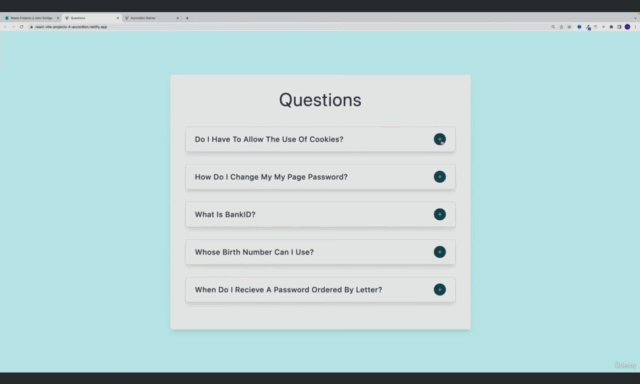

#### 190. [Questions - Setup](#190)

#### 191. [Questions - Render List](#191)

#### 192. [Questions - Toggle Info](#192)

#### 193. [Questions - Alternative Setup](#193)

#### 194. [Questions - CSS (Optional)](#194)

---

<br>

### 190. Questions - Setup<a id="190"></a>

> **_Business Objective: Layout_**



- [Live App](https://react-vite-projects-4-accordion.netlify.app/)

---

##### Figma URL

[Accordion](https://www.figma.com/file/TAwJ3kWOqkw0o8UVtAMOHO/Accordion?node-id=0%3A1&t=1YEti8xBykw69tBH-1)

- install deps

```sh
npm install
```

- spin up dev server

```sh
npm run dev
```

<br>

### 191. Questions - Render List<a id="191"></a>

- Accordian use toggle button logic

##### Steps

#### Examine and Import Data

Review data.js and import the questions array from data.js into your project. This array should contain objects that represent the questions and their associated data, such as the question text

#### Setup State Value

Next, set up the questions array as a state variable using the useState hook. This will allow you to modify the data and have those changes automatically reflected in the rendered output.

#### Render Questions

To display the list of questions, you can iterate over the questions array and render a SingleQuestion component for each item in the array. Each SingleQuestion component should display the question text in the header, along with a button to toggle the question text.

---

- In src folder create Question.jsx -rafce
- In src folder create SingleQuestion.jsx -rafce

- In src/App.jsx

```js
import { useState } from "react";
import data from "./data";

import Questions from "./Questions";

function App() {
  const [questions, setQuestions] = useState(data);

  return (
    <main>
      <Questions questions={questions} />
    </main>
  );
}

export default App;
```

---

- In Questions.jsx

```js
import SingleQuestion from "./SingleQuestion";

const Questions = ({ questions }) => {
  return (
    <section className="container">
      <h1>Questions</h1>

      {questions.map((question) => {
        return (
          <SingleQuestion key={question.id} {...question}></SingleQuestion>
        );
      })}
    </section>
  );
};

export default Questions;
```

---

- In src/SingleQuestion.jsx
- insatll react icon and import them

```js
import React, { useState } from "react";
import { AiOutlineMinus, AiOutlinePlus } from "react-icons/ai";

const SingleQuestion = ({ title, info }) => {
  const [showInfo, setShowInfo] = useState(false);

  return (
    <article className="question">
      <header>
        <h5>{title}</h5>
      </header>

      <p>{info}</p>
    </article>
  );
};

export default SingleQuestion;
```

<br>

### 192. Questions - Toggle Info<a id="192"></a>

#### Toggle Question

In the SingleQuestion component, you can set up the functionality for the toggle button by defining a function that toggles the state of a "showInfo" flag. When the flag is set to true, the answer text will be displayed. When the flag is set to false, only the question text will be displayed.

---

- In src/SingleQuestion.jsx

```js
import React, { useState } from "react";
import { AiOutlineMinus, AiOutlinePlus } from "react-icons/ai";
const SingleQuestion = ({ title, info }) => {
  const [showInfo, setShowInfo] = useState(false);
  return (
    <article className="question">
      <header>
        <h5>{title}</h5>

        <button className="question-btn" onClick={() => setShowInfo(!showInfo)}>
          {showInfo ? <AiOutlineMinus /> : <AiOutlinePlus />}
        </button>
      </header>

      {showInfo && <p>{info}</p>}
    </article>
  );
};

export default SingleQuestion;
```

<br>

### 193. Questions - Alternative Setup<a id="193"></a>

To set up the functionality where only one question is displayed at a time, you can modify the state of the questions array to keep track of the currently selected question. You can do this by defining a function that updates the state to reflect the selected question index. Then, you can use the selected question index to render only the SingleQuestion component that corresponds to the currently selected question.

Overall, the flow of the application should look something like this:

- Import the questions array from data.js into your project.
- Set up the questions array as a state variable using the useState hook.
- Iterate over the questions array and render a SingleQuestion component for each item in the array.
- In the SingleQuestion component, display the question text in the header and a button to toggle the question text.
- Define a function that toggles the state of a "showAnswer" flag, which determines whether the answer text is displayed or not.
- Modify the state of the questions array to keep track of the currently selected question index.
- Define a function that updates the state to reflect the selected question index.
- Use the selected question index to render only the SingleQuestion component that corresponds to the currently selected question.

> Locate in final-alternative folder

  <br>

### 194. Questions - CSS (Optional)<a id="194"></a>

- In src/index.css

```css
/* ============= GLOBAL CSS =============== */

*,
::after,
::before {
  margin: 0;
  padding: 0;
  box-sizing: border-box;
}

html {
  font-size: 100%;
} /*16px*/

:root {
  /* colors */
  --primary-100: #cffafe;
  --primary-200: #a5f3fc;
  --primary-300: #67e8f9;
  --primary-400: #22d3ee;
  --primary-500: #06b6d4;
  --primary-600: #0891b2;
  --primary-700: #0e7490;
  --primary-800: #155e75;
  --primary-900: #164e63;

  /* grey */
  --grey-50: #f8fafc;
  --grey-100: #f1f5f9;
  --grey-200: #e2e8f0;
  --grey-300: #cbd5e1;
  --grey-400: #94a3b8;
  --grey-500: #64748b;
  --grey-600: #475569;
  --grey-700: #334155;
  --grey-800: #1e293b;
  --grey-900: #0f172a;
  /* rest of the colors */
  --black: #222;
  --white: #fff;
  --red-light: #f8d7da;
  --red-dark: #842029;
  --green-light: #d1e7dd;
  --green-dark: #0f5132;

  --small-text: 0.875rem;
  --extra-small-text: 0.7em;
  /* rest of the vars */
  --backgroundColor: var(--grey-50);
  --textColor: var(--grey-900);
  --borderRadius: 0.25rem;
  --letterSpacing: 1px;
  --transition: 0.3s ease-in-out all;
  --max-width: 1120px;
  --fixed-width: 600px;

  /* box shadow*/
  --shadow-1: 0 1px 3px 0 rgba(0, 0, 0, 0.1), 0 1px 2px 0 rgba(0, 0, 0, 0.06);
  --shadow-2: 0 4px 6px -1px rgba(0, 0, 0, 0.1), 0 2px 4px -1px rgba(0, 0, 0, 0.06);
  --shadow-3: 0 10px 15px -3px rgba(0, 0, 0, 0.1), 0 4px 6px -2px rgba(0, 0, 0, 0.05);
  --shadow-4: 0 20px 25px -5px rgba(0, 0, 0, 0.1), 0 10px 10px -5px rgba(0, 0, 0, 0.04);
}

body {
  background: var(--backgroundColor);
  font-family: system-ui, -apple-system, BlinkMacSystemFont, "Segoe UI", Roboto,
    Oxygen, Ubuntu, Cantarell, "Open Sans", "Helvetica Neue", sans-serif;
  font-weight: 400;
  line-height: 1;
  color: var(--textColor);
}
p {
  margin: 0;
}
h1,
h2,
h3,
h4,
h5 {
  margin: 0;
  font-family: var(--headingFont);
  font-weight: 400;
  line-height: 1;
  text-transform: capitalize;
  letter-spacing: var(--letterSpacing);
}

h1 {
  font-size: 3.052rem;
}

h2 {
  font-size: 2.441rem;
}

h3 {
  font-size: 1.953rem;
}

h4 {
  font-size: 1.563rem;
}

h5 {
  font-size: 1.25rem;
}

.text {
  margin-bottom: 1.5rem;
  max-width: 40em;
}

small,
.text-small {
  font-size: var(--small-text);
}

a {
  text-decoration: none;
}
ul {
  list-style-type: none;
  padding: 0;
}

.img {
  width: 100%;
  display: block;
  object-fit: cover;
}
/* buttons */

.btn {
  cursor: pointer;
  color: var(--white);
  background: var(--primary-500);
  border: transparent;
  border-radius: var(--borderRadius);
  letter-spacing: var(--letterSpacing);
  padding: 0.375rem 0.75rem;
  box-shadow: var(--shadow-1);
  transition: var(--transition);
  text-transform: capitalize;
  display: inline-block;
}
.btn:hover {
  background: var(--primary-700);
  box-shadow: var(--shadow-3);
}
.btn-hipster {
  color: var(--primary-500);
  background: var(--primary-200);
}
.btn-hipster:hover {
  color: var(--primary-200);
  background: var(--primary-700);
}
.btn-block {
  width: 100%;
}

/* alerts */
.alert {
  padding: 0.375rem 0.75rem;
  margin-bottom: 1rem;
  border-color: transparent;
  border-radius: var(--borderRadius);
}

.alert-danger {
  color: var(--red-dark);
  background: var(--red-light);
}
.alert-success {
  color: var(--green-dark);
  background: var(--green-light);
}
/* form */

.form {
  width: 90vw;
  max-width: var(--fixed-width);
  background: var(--white);
  border-radius: var(--borderRadius);
  box-shadow: var(--shadow-2);
  padding: 2rem 2.5rem;
  margin: 3rem auto;
}
.form-label {
  display: block;
  font-size: var(--small-text);
  margin-bottom: 0.5rem;
  text-transform: capitalize;
  letter-spacing: var(--letterSpacing);
}
.form-input,
.form-textarea {
  width: 100%;
  padding: 0.375rem 0.75rem;
  border-radius: var(--borderRadius);
  background: var(--backgroundColor);
  border: 1px solid var(--grey-200);
}

.form-row {
  margin-bottom: 1rem;
}

.form-textarea {
  height: 7rem;
}
::placeholder {
  font-family: inherit;
  color: var(--grey-400);
}
.form-alert {
  color: var(--red-dark);
  letter-spacing: var(--letterSpacing);
  text-transform: capitalize;
}
/* alert */

@keyframes spinner {
  to {
    transform: rotate(360deg);
  }
}

.loading {
  width: 6rem;
  height: 6rem;
  border: 5px solid var(--grey-400);
  border-radius: 50%;
  border-top-color: var(--primary-500);
  animation: spinner 0.6s linear infinite;
  margin: 0 auto;
}

/* title */

.title {
  text-align: center;
}

.title-underline {
  background: var(--primary-500);
  width: 7rem;
  height: 0.25rem;
  margin: 0 auto;
  margin-top: 1rem;
}
/* ============= PROJECT CSS =============== */
/* optional */

body {
  background: var(--primary-100);
}
main {
  min-height: 100vh;
  /* using flex because of better browser support */
  display: flex;
  justify-content: center;
  align-items: center;
}

.container {
  width: 90vw;
  margin: 5rem auto;
  background: var(--white);
  border-radius: var(--borderRadius);
  padding: 2.5rem;
  max-width: 800px;
  box-shadow: var(--shadow-3);
}
.container h1 {
  text-align: center;
  margin-bottom: 3rem;
  color: var(--grey-700);
}
.question {
  padding: 1rem 1.5rem;
  border: 2px solid var(--grey-200);
  margin-bottom: 1rem;
  border-radius: var(--borderRadius);
  box-shadow: var(--shadow-3);
  margin-bottom: 2rem;
}

.question p {
  color: var(--grey-500);
  line-height: 2;
  margin-top: 1rem;
}
.question header {
  display: flex;
  justify-content: space-between;
  align-items: center;
  gap: 1rem;
}
.question h5 {
  font-weight: 500;
  line-height: 1.5;
  color: var(--grey-700);
}
.question-btn {
  background: transparent;
  border-color: transparent;
  width: 2rem;
  height: 2rem;
  background: var(--primary-900);
  display: flex;
  align-items: center;
  justify-content: center;
  border-radius: 50%;
  color: var(--white);
  cursor: pointer;
  /* optional - last item */
  align-self: flex-start;
  min-width: 2rem;
}
```

<br>
